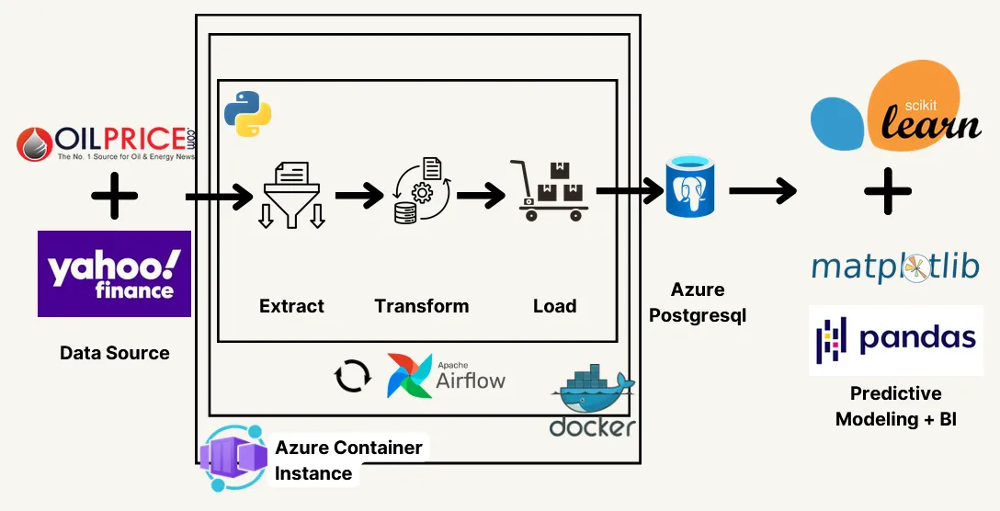

# Stock vs Oil Price Correlation Analysis

This project combines ETL processes with analytical workflows to uncover the relationship between stock price changes and oil price changes.

The ETL pipeline is orchestrated using **Airflow**, deployed with **Docker** and **Azure Container Instance**, and leveraging **Azure PostgreSQL** as the database backend.

## 🏗️ Architecture

  
*Data Flow: High-level architecture — data sources (OilPrice, Yahoo Finance) → Airflow ETL (containerized with Docker, deployed on Azure Container Instance) → Azure PostgreSQL → Analysis (pandas, scikit-learn, matplotlib).*

## 🛠 Tech Stack

- Orchestration: **Apache Airflow**
- Containerization: **Docker**, **Docker Compose** (local)
- Cloud runtime: **Azure Container Instance** (ACI)
- Database: **Azure Database for PostgreSQL**
- Language & libs: **Python 3.8+**, `pandas`, `psycopg2-binary`, `matplotlib`, `beautifulsoup4`, `requests`, `pymysql`, `scikit-learn`
- Monitoring/logging: Airflow UI

## ✨ Key Features

- **ETL with Airflow**: Fetch and transform data using Airflow DAGs.  
- **Containerized Deployment**: Easily deploy the workflow using Docker and Azure Container Instance.  
- **Data Normalization and Analysis**: Perform Z-Score normalization and correlation analysis of stock and oil price changes.  
- **Azure Integration**: Store and manage data in Azure PostgreSQL for scalability and reliability.  
- **Data Visualization**: Plot raw and normalized trends, and display scatter plots for relationships.

## 🚀 How to Run

1. **Set Up the Database:**  
   Ensure your Azure PostgreSQL database contains the required tables:
   - `company_stocks`: Contains columns `stock_change`, `datetime`, `ticker`, `open`, `price`, `average_stock_price`.
   - `oil_prices`: Contains columns `price_change`, `datetime`, `price_id`, `type`, `price_change`, `normalized_price`.

2. **Set Up the Docker and Airflow:**  
   Ensure your docker machine is running and run the following command:
   - `docker pull puckel/docker-airflow`
   - `docker run -d -p 8080:8080 puckel/docker-airflow webserver` (you should be able to see Airflow run on localhost:8080)
   - Download `mains_dag.py` from this repository (make sure to change database credential with your own)
   - `docker cp path_to_mains_dag.py container_name:/usr/local/airflow/dags`
   - `docker exec -it container_name bash` (go to inside container)
   - `pip install psycopg2-binary pandas matplotlib beautifulsoup4 requests pymysql`
   - `docker restart container_name`
   - Go to localhost:8080 and turn on the dag

3. **Check data on your database**

4. **Run the analysis:**  
   - Download `correlation_analysis.py` from this repository  
   - Run `correlation_analysis.py` (make sure to change database credential with your own)

## 📜 Note

- Link to Notion (Blog post): [Click_me](https://www.notion.so/Data-Pipelining-1442890c34e88091bf36f315f63a5946?pvs=4)  
- Presentation Video: [Click_me](https://drive.google.com/drive/folders/1-8X9MAkrhXsZDo1v88JOgb6w2Xy6NyK3?usp=sharing)  
- Link to Google Colab: [Click_me](https://colab.research.google.com/drive/1zjjIyVeKH-xb-9XHfVfcTemJhBRDpNsp?usp=sharing)  
- Link to Airflow Azure Container Instance: [Click_me](https://data-pipeline-oil.agreeableflower-bf1ef051.southeastasia.azurecontainerapps.io)
